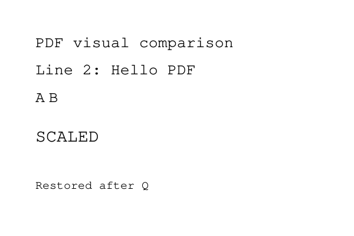
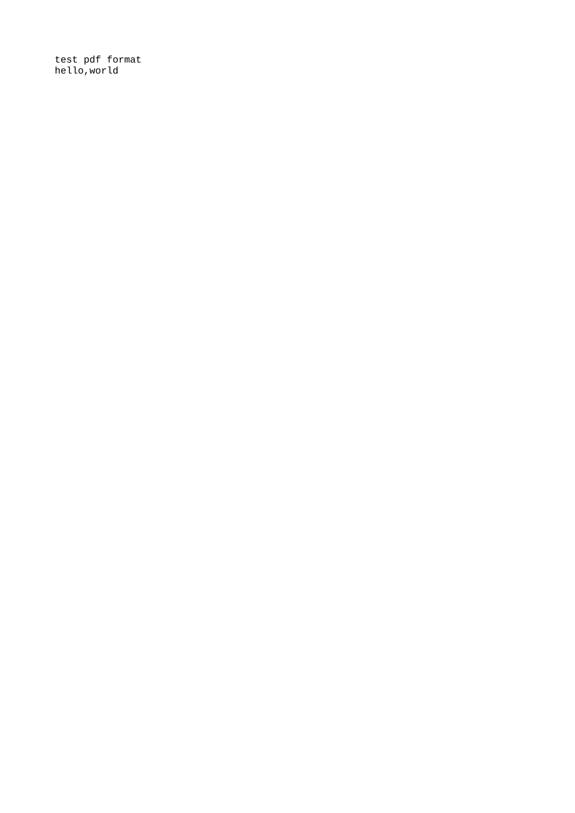
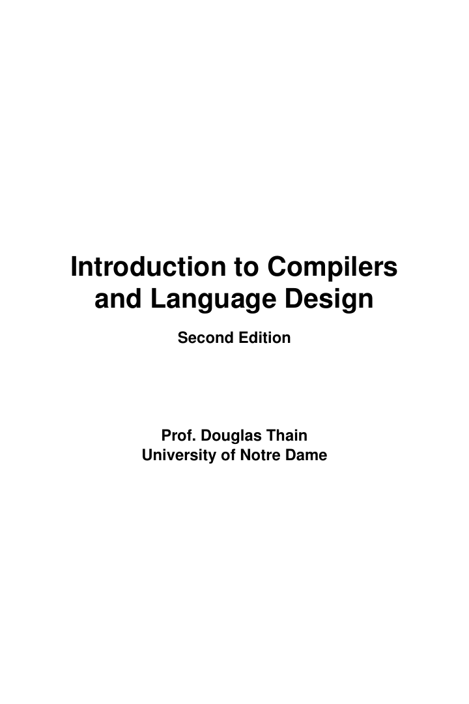
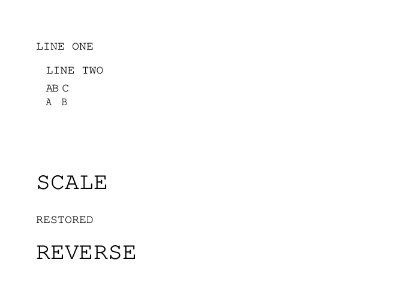
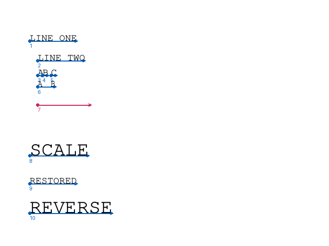
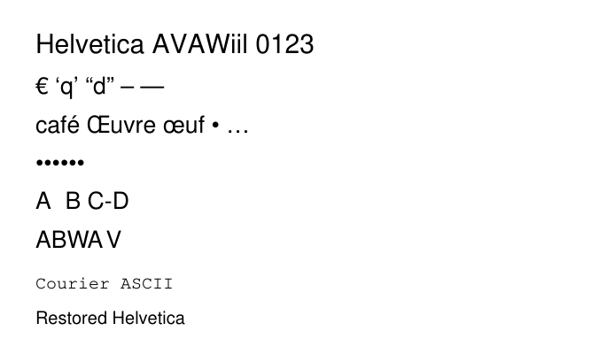
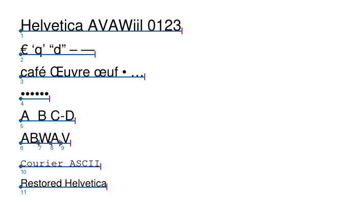
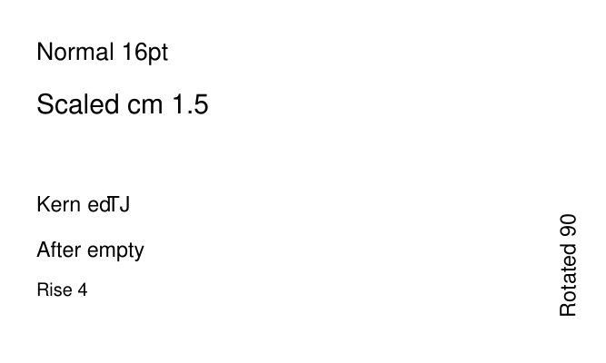
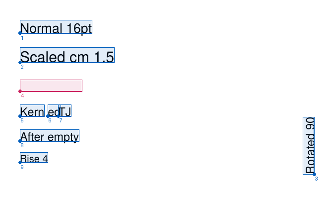

# PDF 畫面與實際解析結果對照

[開啟左右對照報告](../output/pdf/m7-comparison/index.html)：左側是原始 PDF 第 1 頁的實際渲染，右側是本專案 CLI、M7 visitor 診斷 trace 與 Poppler 參考文字。點擊圖片可查看完整解析度。

本節保留 M7 基線；最新 M8 實作與座標驗收見下方「M8 完成驗收」。M7 基線的三種證據分開標示：

- **本專案輸出**：`pdftext --dump-content` 真實 stdout／stderr／exit code；自訂 probe 透過真實 M6／M7 interface 取得 raw string bytes 與操作 operands。
- **外部參考**：Poppler 的頁面 PNG、`pdftotext` 文字與 word bounding boxes；不是本專案已提取出的 Unicode 或座標。
- **待驗證項目**：M8 glyph origin／advance、M9 Unicode、M10 TextItem 與 M11 閱讀順序，不能以這次 M7 bytes 對照宣稱通過。

來源 SHA-256、binary hash、工具版本、執行命令與狀態見 [manifest.json](../output/pdf/m7-comparison/manifest.json)。可重跑方法見 [README](../output/pdf/m7-comparison/README.md)。渲染固定第 1 頁、120 DPI、無人工排版或修改畫面；正式 CLI 仍檢查整份 PDF。

## 可成功解析的 PDF 測試頁

來源：[visual-m7-text.pdf](../tests/fixtures/visual-m7-text.pdf)。這是新增的實際 PDF 檔案，含有效頁樹、traditional xref、字型資源 Courier、明示的 `/Widths` 與 content stream；不是將預期文字畫成 PNG。Courier code 32–126 的 widths 全為 600，讓後续 M8 測試 provider 能使用與 PDF 明確一致的資料。



本專案 CLI 真實輸出：

```text
PAGES 1
PAGE 1 OPS 22 TEXT_SHOWS 5
```

[完整 M7 visitor trace](../output/pdf/m7-comparison/visual-trace.stdout) 取得的原始字串片段如下；右欄只將可列印 ASCII bytes 顯示，沒有做字型 Unicode 解碼：

| M7 string bytes（hex） | ASCII 預覽 |
|---|---|
| `5044462076697375616C20636F6D70617269736F6E` | `PDF visual comparison` |
| `4C696E6520323A2048656C6C6F20504446` | `Line 2: Hello PDF` |
| `41` | `A` |
| `42` | `B` |
| `5343414C4544` | `SCALED` |
| `526573746F7265642061667465722051` | `Restored after Q` |

5 次 text-show 操作包含 6 個 string segments，因為 TJ array 中的 A、B 是兩個片段。外部 [Poppler 參考文字](../output/pdf/m7-comparison/visual-reference.stdout) 顯示相同的內容與順序；去掉 whitespace 後逐字比較通過。這個檢查不證明空白、字距、座標、Unicode 或一般 PDF 閱讀順序正確。

這頁未來的 M8 預期基線／起點（由 fixture 指令手算，**尚非目前 parser 計算結果**）：

| 片段 | 預期 user-space origin | 來源與效果 |
|---|---|---|
| PDF visual comparison | `(36,192)` | Tm 直接設定，size 16 |
| Line 2: Hello PDF | `(36,164)` | TD 往下 28，leading=28 |
| A | `(36,136)` | T* 再往下 28 |
| B | `(49.6,136)` | A advance=9.6，TJ -250 再右移 4 |
| SCALED | `(36,96)` | Tm `(24,64)` 經 CTM 1.5 倍，有效文字大小 18 |
| Restored after Q | `(36,48)` | Q 恢復 CTM，新的 Tf size 12 |

M8 實作後須用真實 geometry trace 填入 actual 欄並計算偏差，目前只保存 expected。這裡仍有可渲染的靜態 PDF、外部 reference 與真正的 M7 操作／bytes，可以追查誤差來自哪一層。

## 現有 hello.pdf

來源：[hello.pdf](../tests/hello.pdf)。



外部參考文字：

```text
test pdf format
hello,world
```

本專案 stdout 為空、exit code 4；[stderr](../output/pdf/m7-comparison/hello-cpt.stderr) 為：

```text
content: unsupported error at byte 7437: decoded byte 4: content operator is not supported
```

真實 M6 decoded prefix 從 `0.1 w` 開始，故拒絕點是 w。後續包含 BMC、re、W*、EMC、BDC 等未支援功能。外部 renderer 能顯示不代表本專案已成功解析；這是「相容性缺口」紀錄，不是通過案例。

## 現有 compilerbook.pdf

來源：本機 `tests/compilerbook.pdf`，原本未追蹤；只渲染及提取第 1 頁參考，不複製整本 PDF 到報告，也不自動加入 git。



封面可被 Poppler 顯示；本專案 stdout 為空、exit code 4，尚未進入 M6／M7：

```text
xref: unsupported error at byte 1306685: xref streams are unsupported
```

[參考文字](../output/pdf/m7-comparison/compilerbook-reference.stdout) 僅供對照畫面；xref stream 在現行 roadmap 的後續範圍，M8 不以此書成功提取作為驗收條件。

## 核對結果

| 核對項目 | 結果 |
|---|---|
| 三份原始 PDF 第 1 頁渲染且人工查看 | 完成 |
| 可渲染 fixture 的 M7 摘要與 golden | 通過，22 operations／5 text shows |
| 可渲染 fixture 的 ASCII bytes 内容／順序與外部參考 | 通過（whitespace normalization） |
| hello.pdf 成功提取 | 未支援，記錄 w 拒絕點 |
| compilerbook.pdf 成功提取 | 未支援，記錄 xref stream 拒絕點 |
| M8 座標／字距／縮放與畫面一致 | 已完成，見下方 M8 證據 |
| M9–M11 Unicode／TextItem／閱讀順序一致 | 待實作與驗證 |

新增 fixture 已接入 `tests/fixtures.tsv`，64 筆 CLI fixtures 全部通過。截圖與外部參考生成屬於額外人工／可選驗證，不將 Poppler、Python 或 browser 變成既有 `make test`／`make asan` 的必需依賴。


## M8 完成驗收

[最新左右對照報告](../output/pdf/m8-comparison/index.html) 同時保存原始 PDF 真實渲染、獨立 origin／advance overlay、專案 raw trace、expected／actual／delta 與容差。來源 hash、實際 PNG 尺寸、頁面屬性、工具版本和命令見 [manifest](../output/pdf/m8-comparison/manifest.json)；完整重跑步驟見 [README](../output/pdf/m8-comparison/README.md)。舊 M7 報告的 pending 註記只代表當時基線。

新增 `geometry-raw.pdf` 使用有效 Courier 字型資源、明示 codes 32–126 widths=600。整頁 C consumer 的 Courier-600 是測試 adapter，與 PDF 實際資料一致；正式 CLI 沒有固定寬度 fallback。其 raw／Flate／Contents array 版本的完整 trace 逐 byte 對 golden 相同。




兩份受控 PDF 共 16 個 string events 的 raw bytes、origin、advance、rendering matrix 與 mode 全部通過獨立預期表；容差為 absolute 1e-8 + relative 1e-9。人工已查看原始截圖與 overlay，位置、基線、字距與方向一致（2 px 觀察容差）。Tr=3 的粉紅色事件沒有可見 glyph，符合原始 content 指令。advance 不是 glyph ink bbox，Poppler word boxes 也不當作 baseline 比較。

原 M7 fixture 的 M8 actual 已補齊：

| ASCII 預覽 | expected origin | actual origin | actual advance | origin delta |
|---|---|---|---|---|
| PDF visual comparison | (36,192) | (36,192) | (201.6,0) | (0,0) |
| Line 2: Hello PDF | (36,164) | (36,164) | (163.2,0) | (0,0) |
| A | (36,136) | (36,136) | (9.6,0) | (0,0) |
| B | (49.6,136) | (49.6,136) | (9.6,0) | (0,0) |
| SCALED | (36,96) | (36,96) | (64.8,0) | (0,0) |
| Restored after Q | (36,48) | (36,48) | (115.2,0) | (0,0) |

新增頁涵蓋多行、Td 回到行起點、TJ 正負調整、Tc/Tw/Tz/Ts、非交換 cm 次序、q/Q 與不可見 Tr=3。兩份現有真實 PDF 均重新渲染與執行：hello.pdf 仍在 `w` 拒絕，compilerbook.pdf 仍在 xref stream 拒絕，exit 4 且 stdout 空白；報告記錄實際 stderr，未宣称相容。

M8 的 snapshot／library JSON dump 是診斷資料，字串仍為 raw bytes／ASCII 預覽。M9 Unicode／真實 font adapter、M10 TextItem、M11 閱讀順序仍待實作。

## M9 完成驗收

[M9 左右對照報告](../output/pdf/m9-comparison/index.html) 使用**正式 M9 font adapter**（`src/font.c`、`src/font_text.c`），透過 `tests/font-text-test` staged probe 讀取實際 font dictionaries。來源 hash、binary hash、Poppler 版本、實際使用的字型檔、命令與 exit code 見 [manifest](../output/pdf/m9-comparison/manifest.json)；重跑方法見 [README](../output/pdf/m9-comparison/README.md)。

- **預期寬度來源獨立**：以 fontTools 讀 Poppler 實際渲染用的字型檔（`fc-match Helvetica` → NimbusSans-Regular、`fc-match Courier` → NimbusMonoPS-Regular），不是讀 fixture 的 `/Widths`。[fixture 生成腳本](../tests/make-font-fixtures.py) 的 224 個 Helvetica WinAnsi widths 全部等於渲染字型；除 Euro 外也等於 Adobe Helvetica AFM（1990 版無 Euro）。
- **預期 Unicode 來源獨立**：Python cp1252 codec 加上 PDF WinAnsi 的 bullet／控制字元政策，逐 byte 比較 UTF-8（含 NBSP、soft hyphen、U+FFFD）。Poppler `pdftotext` 只作外部參考。




| # | Raw hex | 專案 UTF-8（escaped） | Width 來源 | actual origin | actual advance |
|---|---|---|---|---|---|
| 1 | `48656c…313233` | `Helvetica AVAWiil 0123` | widths | (24,204) | 189.054 |
| 2 | `80209171922093649420962097` | `€ ‘q’ “d” – —` | widths | (24,176) | 87.136 |
| 3 | `636166e9208c75767265209c756620952085` | `café Œuvre œuf • …` | widths | (24,150) | 145.2 |
| 4 | `7f818d8f909d` | `•` ×6 | widths | (24,124) | 33.6 |
| 5 | `412042a043ad44`（Tw 5） | `A B C­D` | widths | (24,98) | 63.672 |
| 6 | `410042` | `A�B` | widths、descriptor-default-zero | (24,72) | 21.344 |
| 7–9 | TJ `[(W) 80 (A) -120 (V)]` | `W`、`A`、`V` | widths | (45.344／59.168／71.76, 72) | 15.104／10.672／10.672 |
| 10 | `436f…4949`（F2，q 內） | `Courier ASCII`（ascii-fallback） | widths | (24,44) | 93.6 |
| 11 | `5265…6361`（Q 後 F1） | `Restored Helvetica` | widths | (24,20) | 101.364 |

全部 13 個 string（含 `font-pages.pdf` 兩頁同名 `/F1` 分別指向 Helvetica／Courier）的 raw bytes、UTF-8、origin、advance 與 rendering matrix 皆通過，容差 absolute 1e-8 + relative 1e-9。第 5 行證明 Tw 只加在原始 0x20，NBSP 以原始 code 查寬度但不加 Tw；第 6 行的 NUL 解成 U+FFFD，寬度來自 descriptor default zero。人工查看原始截圖與 overlay：每個 string 的基線、起點與 advance 終點都與實際字形對齊（2 px 內）。Poppler 也把 0x81 等 code 畫成 bullet，與本專案 Unicode 政策一致。

`geometry-raw.pdf` 經真實 adapter 的 raw geometry 行與 M8 測試 adapter golden 逐 byte 相同。`hello.pdf` 仍在 `w` 拒絕、`compilerbook.pdf` 仍在 xref stream 拒絕：exit 4、stdout 空白，未因 M9 變成假成功。advance 終點不是 glyph ink bbox；trace 為 source order，閱讀順序屬 M11。M10 TextItem 尚未實作。

## M10 完成驗收

[M10 對照報告](../output/pdf/m10-comparison/index.html) 比對正式 CLI `pdftext --dump-text-items` 的實際輸出。預期值由 [capture.py](../output/pdf/m10-comparison/capture.py) 以自己的矩陣乘法與 Poppler 渲染字型的 advance 獨立計算；hash、命令與版本見 [manifest](../output/pdf/m10-comparison/manifest.json)，重跑方法見 [README](../output/pdf/m10-comparison/README.md)。




框從 baseline origin 沿 advance 向量延伸，高度為 `em_height`（有效 em 大小，**不是 glyph ink bbox**）；數字為 sequence。

| seq | order | 文字 | x, y | width | em_height | 說明 |
|---|---|---|---|---|---|---|
| 1 | 0 | Normal 16pt | 24, 200 | 87.136 | 16 | 基準 |
| 2 | 1 | Scaled cm 1.5 | 24, 165 | 114.048 | 18 | 名目 12、有效 18 |
| 3 | 2 | Rotated 90 | 380, 30 | 0（advance `(0, 68.488)`） | 14 | 保留，`horizontal=0` |
| 4 | 3 | Invisible Tr3 | 24, 130 | 75.46 | 14 | Tr=3 保留，畫面無字形 |
| 5–7 | 4–6 | Kern／ed／TJ | 24／57.768／70.536, 100 | 29.568／15.568／15.554 | 14 | TJ 三段，數字不產生 item |
| 8 | 8 | After empty | 24, 70 | 71.582 | 14 | 空字串不產生 item，order 7 空缺 |
| 9 | 9 | Rise 4 | 24, 44 | 34.008 | 12 | rise 移動 origin，不改 em_height |

`text-items-transform.pdf` 的 9 個 items 與 `font-winansi.pdf` 前 4 個 items 的 UTF-8、origin、advance、width、em_height、字級、mode、horizontal 與 order 全部通過（absolute 1e-6，dump 為九位小數）。人工查看 overlay：每個框的起點與終點都對齊實際字形的基線與 advance（2 px 內），旋轉項目的框沿旋轉後的基線。`hello.pdf`、`compilerbook.pdf` 仍 exit 4、stdout 空白。items 依 source order 排列；閱讀順序、synthetic space 與純文字輸出屬 M11。
